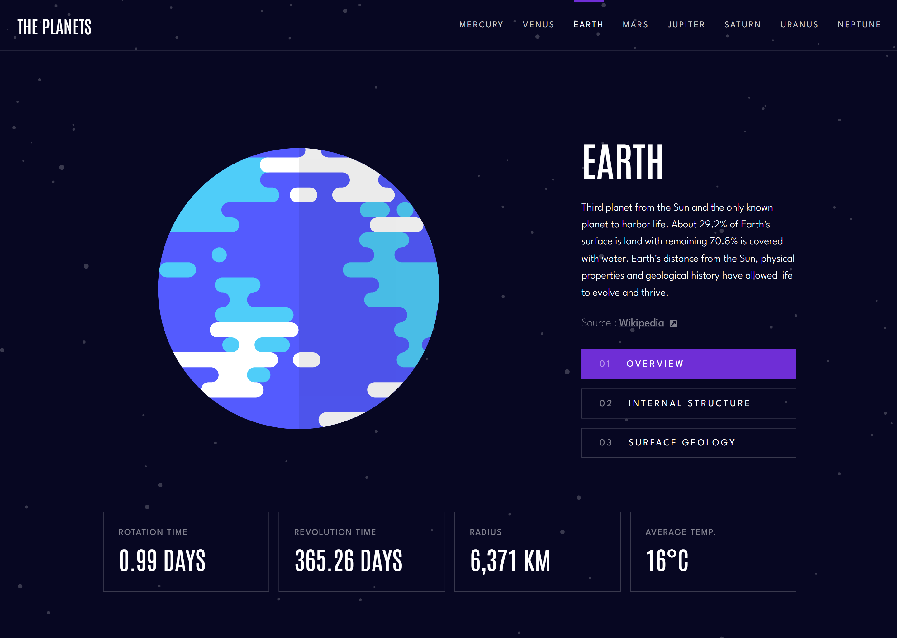

# Responsive Planet Facts Site

## Challenge

Users should be able to:

- View the optimal layout for the app depending on their device's screen size
- See hover states for all interactive elements on the page
- View each planet page and toggle between "Overview", "Internal Structure", and "Surface Geology"

### Links

- [Solution](https://www.frontendmentor.io/solutions/responsive-planet-facts-site-using-react-Jbwyb4I7Wh)
- [Live Site](https://planet-facts-fm.netlify.app/)

### Built with

- React/JSX
- CSS Styled Components
- Flexbox
- Desktop-first workflow

## Author

- Frontend Mentor [@Isaiah-B](https://www.frontendmentor.io/profile/Isaiah-B)
